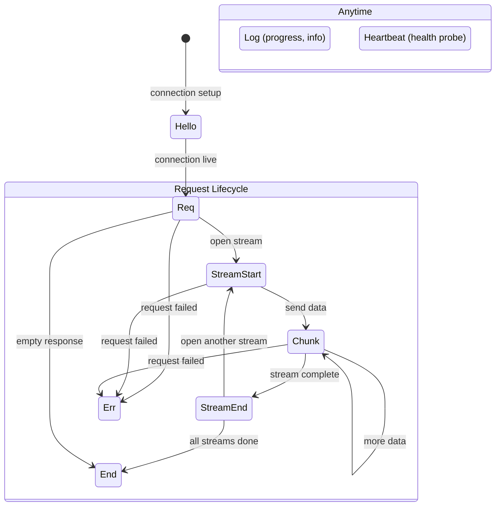

# Frame Protocol

The binary wire format: frame types, CBOR encoding, field semantics.

## Wire Format

Every capdag message is a length-prefixed CBOR frame:

```
┌──────────────────────────────────────────┐
│  4 bytes: u32 big-endian payload length  │
├──────────────────────────────────────────┤
│  N bytes: CBOR-encoded map (integer keys)│
└──────────────────────────────────────────┘
```

The 4-byte prefix gives the exact byte count of the CBOR payload that follows. The receiver reads exactly that many bytes, then decodes the CBOR map.

There are two size limits:

- **Negotiated max_frame** (default 3.5 MB / 3,670,016 bytes): Set during handshake. Frames larger than this are rejected by both reader and writer.
- **Hard limit** (16 MB / 16,777,216 bytes): An absolute ceiling to prevent memory exhaustion. Cannot be negotiated upward.

Payloads that exceed max_frame must be split into chunks (see [12.4-STREAMING.md](/docs/12.4-streaming)).

Source: `capdag/src/bifaci/io.rs` (`encode_frame`, `decode_frame`, `write_frame`, `read_frame`).

## Frame Structure

The CBOR payload is a map with integer keys. Every frame has three required keys (version, frame_type, id). All other keys are optional and their presence depends on the frame type.

### Key Reference Table

| Key | Name | Type | Description |
|-----|------|------|-------------|
| 0 | version | u8 | Protocol version. Always 4. Any other value is rejected. |
| 1 | frame_type | u8 | Discriminant identifying the frame type (see below). |
| 2 | id | bytes[16] or uint | Request ID. UUID for requests, uint for control frames. |
| 3 | seq | u64 | Sequence number within a flow. Assigned by SeqAssigner at output. |
| 4 | content_type | text | MIME-like content type of the payload. |
| 5 | meta | map | String-keyed metadata map. Contents depend on frame type. |
| 6 | payload | bytes | Binary payload data. |
| 7 | len | u64 | Total byte count for a chunked transfer. Set on the first chunk only. |
| 8 | offset | u64 | Byte offset of this chunk within the stream. |
| 9 | eof | bool | True on the final chunk of a stream or on END frames. |
| 10 | cap | text | Cap URN for REQ frames. Identifies which capability to invoke. |
| 11 | stream_id | text | UUID identifying a stream within a request. |
| 12 | media_urn | text | Media URN identifying the data type of a stream. |
| 13 | routing_id | bytes[16] or uint | XID assigned by RelaySwitch for routing. |
| 14 | chunk_index | u64 | Zero-based index of this chunk within its stream. |
| 15 | chunk_count | u64 | Total number of chunks in a stream. Set on STREAM_END. |
| 16 | checksum | u64 | FNV-1a 64-bit hash of the chunk payload. |
| 17 | is_sequence | bool | Whether the producer used emit_list_item (true) or write (false). STREAM_START only. |
| 18 | force_kill | bool | Whether Cancel force-kills the cartridge process. Cancel only. |
| 19 | credit | u64 | Flow-control grant in CHUNK units. Credit frames only. |
| 20 | unbounded | bool | Stream makes no length promise (L16). STREAM_START only. |

Source: `capdag/src/bifaci/frame.rs` (keys module, line 910; Frame struct, line 184).

## Frame Types

The following diagram shows how frame types relate within a request lifecycle:



### Hello (0)

Sent once by each side during connection setup. The host sends Hello first (no manifest); the cartridge responds with Hello including a JSON-encoded manifest in `meta["manifest"]`. The cartridge manifest has the structure:

```json
{
  "name": "mycartridge",
  "version": "1.0.0",
  "description": "...",
  "cap_groups": [
    {
      "name": "default",
      "caps": [{"urn": "cap:effect=none", "title": "Identity", ...}, ...],
      "adapter_urns": []
    }
  ]
}
```

The meta map also carries limit proposals: `max_frame`, `max_chunk`, and `max_reorder_buffer`. Both sides negotiate limits by taking the minimum of the two proposals. A cartridge's HELLO additionally carries the mandatory `pools` entry: JSON bytes encoding its full concurrency-pool state map (one singleton pool per registered cap, every manifest-declared shared pool, and the reserved `all` pool — each with `declared`/`configured`/optional `available`/`active`/`queued`; see 13.1). A missing or malformed map is a protocol violation, not an invitation to infer a default. The heartbeat is the capacity CONFIG channel: a probe may carry `desired_capacities` (JSON bytes: pool name → operator `configured` value), and every heartbeat reply carries the mandatory refreshed `pools` map. An unknown pool name refuses the whole desired batch with an `UNKNOWN_POOL` ERR in place of the reply. See [12.3-HANDSHAKE.md](/docs/12.3-handshake) for the full handshake sequence.

Hello uses `id = Uint(0)` — it is not associated with any request.

Source: `frame.rs` (`Frame::hello`, `Frame::hello_with_manifest`).

### Req (1)

Initiates a capability invocation. The `cap` field (key 10) carries the cap URN to invoke. The request may include a payload and content_type for inline data, though most arguments arrive as separate streams (STREAM_START/CHUNK/STREAM_END).

The `routing_id` (key 13) is assigned by the RelaySwitch at routing boundaries. Cartridges sending peer invocations do not set routing_id — it is added by the infrastructure.

The cap URN is validated at construction time — `Frame::req()` panics if the URN is malformed. This is intentional: invalid URNs are bugs, not runtime errors.

Source: `frame.rs` (`Frame::req`).

### Chunk (3)

Carries a piece of streaming data within a named stream. Required fields:

- `stream_id` (key 11): Which stream this chunk belongs to.
- `chunk_index` (key 14): Zero-based position of this chunk within the stream. Monotonically increasing.
- `checksum` (key 16): FNV-1a 64-bit hash of the payload bytes. Mandatory for corruption detection.

Optional fields set by the chunking layer:

- `offset` (key 8): Byte offset of this chunk's data within the total stream.
- `len` (key 7): Total byte count. Set on the first chunk only (chunk_index = 0).
- `eof` (key 9): True on the last chunk.
- `content_type` (key 4): Set on the first chunk only.

Source: `frame.rs` (`Frame::chunk`, `Frame::chunk_with_offset`).

### End (4)

Terminal frame that signals all streams for a request are complete. No flow frame may follow an END for the same request ID (L4) — runtimes drop and count post-terminal frames, never write them. May carry an optional final payload.

The `eof` field is set to true. A successful END carries `exit_code = 0` in meta and MAY carry **terminal metadata**: `progress` (f64) and `message`. The terminal progress is the authoritative final progress event (L5) — it rides in the terminal frame itself and therefore cannot race it. A successful END without an explicit `progress` reads as 1.0; a failed END never synthesizes one.

Source: `frame.rs` (`Frame::end`).

### Log (5)

Carries source diagnostics and progress updates. The `meta` map (key 5) contains:

- `level` (non-empty text): One of `"info"`, `"warn"`, `"error"`, `"progress"`, or a source-defined level.
- `message` (non-empty text): Human-readable message.
- `attribution_class` (text, mandatory for non-progress LOG): One of `input` | `resource` | `environment` | `internal`.
- `arg_urn` (non-empty text, optional for non-progress LOG): The one argument the source attributes the diagnostic to.
- `progress` (float, optional): A value between 0.0 and 1.0. Present only when `level` is `"progress"`.

Progress frames are LOG frames with `level = "progress"`. They are constructed only through the progress API and do not carry diagnostic attribution. A non-progress LOG must carry a valid `attribution_class`; missing or unknown values are protocol violations. `arg_urn` is present only when the emit source knows that the message concerns one argument. Receivers never infer either field.

LOG frames can appear at any point during a request, interleaved with CHUNK frames. They do not affect the data stream.

Source: `frame.rs` (`Frame::log`, `Frame::progress`, `log_level`, `log_message`, `log_progress`, `attribution_class`, `attribution_arg_urn`).

### Err (6)

Terminal frame that signals failure. Like END, no further frames may follow for this request. The `meta` map carries:

- `code` (non-empty text): Machine-readable error code.
- `attribution_class` (text): Whose domain the failure belongs to, declared at the definition or emit site. One of `input` | `resource` | `environment` | `internal`.
- `message` (non-empty text): Human-readable error description.
- `arg_urn` (non-empty text, optional): The media URN of the one argument the source attributes the failure to.

All three required fields are strict. A missing or unknown `attribution_class` is a protocol violation; receivers do not manufacture `internal`. When the source cannot attribute the failure to one argument, `arg_urn` is absent, never empty. See [17.2 Error Handling](/docs/17.2-error-handling) and the repo-root `docs/failure-taxonomy.md`.

ERR and END are mutually exclusive terminals. A request ends with exactly one of them.

Source: `frame.rs` (`Frame::err`, `error_code`, `attribution_class`, `attribution_arg_urn`, `error_message`).

### Heartbeat (7)

Health monitoring frame. Either side can send a Heartbeat; the receiver must respond with a Heartbeat carrying the same `id`. The CartridgeHostRuntime sends heartbeats every 30 seconds and expects a response within 10 seconds. A cartridge that fails to respond is marked unhealthy.

Heartbeat frames bypass sequence numbering — they are not flow frames and do not participate in ordering.

Source: `frame.rs` (`Frame::heartbeat`); see also `host_runtime.rs` (`HEARTBEAT_INTERVAL`, `HEARTBEAT_TIMEOUT`).

### StreamStart (8)

Announces a new named stream within a request. Carries:

- `stream_id` (key 11): A UUID uniquely identifying this stream within the request.
- `media_urn` (key 12): The media URN (see [./11-MEDIA-URNS.md](/docs/11-media-urns)) that identifies the data type of the stream.

Multiple STREAM_START frames per request enable multi-argument invocations — each argument is a separate stream with its own media URN.

Source: `frame.rs` (`Frame::stream_start`).

### StreamEnd (9)

Marks the end of a specific stream. After this frame, any CHUNK for the same stream_id is a protocol error. Carries:

- `stream_id` (key 11): The stream being ended.
- `chunk_count` (key 15): The total number of CHUNK frames sent in this stream, by the sender's count. The receiver can verify it received all chunks. A stream announced `unbounded` makes no length promise and its STREAM_END omits `chunk_count` (L16).

Source: `frame.rs` (`Frame::stream_end`).

### RelayNotify (10)

Sent by a RelaySlave to its paired RelayMaster to advertise the capabilities available on that host. The `meta` map carries:

- `manifest` (bytes): JSON-encoded object with the structure:
  ```json
  {
    "caps": ["cap:effect=none", "cap:in=...;out=...;generate", ...],
    "installed_cartridges": []
  }
  ```
  `caps` is a flat list of capability URN strings from all healthy cartridges on the host. `installed_cartridges` carries cartridge process metadata. CAP_IDENTITY (`cap:effect=none`) must be present — the RelaySwitch rejects the connection otherwise.
- `max_frame`, `max_chunk`, `max_reorder_buffer`: Protocol limits for this relay connection.

RelayNotify frames are intercepted by the relay — they never pass through to the other side. The master stores the manifest and limits and makes them available to the RelaySwitch for routing decisions.

Source: `frame.rs` (`Frame::relay_notify`); see also [14.3-RELAY-TOPOLOGY.md](/docs/14.3-relay-topology).

### Credit (13)

Grants per-stream flow-control credit to the sender of a stream (see
[12.5-FLOW-CONTROL.md](/docs/12.5-flow-control)). Carries the target request's
RID in key 2, an optional `stream_id` (key 11 — absent means the request's
sole stream), and the grant count in `credit` (key 19, CHUNK units).
Intermediaries forward Credit end-to-end like Cancel; they never originate or
absorb it (L11). A CREDIT frame without a credit count is rejected at decode.

### RelayState (11)

Sent by a RelayMaster to its paired RelaySlave to provide host resource information. The `payload` (key 6) carries an opaque blob (CBOR or JSON encoded by the engine) containing resource state such as model paths, GPU availability, or capability demands.

Like RelayNotify, RelayState frames are intercepted by the relay and never pass through.

Source: `frame.rs` (`Frame::relay_state`).

## MessageId

Frame IDs come in two variants:

- **Uuid**: 16 random bytes (v4 UUID). Used for request IDs and stream IDs — anything that needs to be globally unique.
- **Uint**: A 64-bit integer. Used for control frames (Hello uses `id = 0`, Heartbeat can use any integer).

UUIDs are encoded as CBOR byte strings (major type 2, 16 bytes). Integers are encoded as CBOR unsigned integers (major type 0).

Source: `frame.rs` (`MessageId` enum).

## Flow Frames vs Control Frames

Frames are classified as **flow** or **non-flow**. The distinction matters for sequence numbering and reordering:

- **Flow frames**: Req, Chunk, End, Log, Err, StreamStart, StreamEnd. These participate in sequencing — the `SeqAssigner` assigns monotonically increasing `seq` values per flow, and the `ReorderBuffer` at relay boundaries reorders them if they arrive out of sequence.
- **Non-flow frames**: Hello, Heartbeat, RelayNotify, RelayState, Cancel, Credit. These bypass sequence assignment entirely (their `seq` stays at 0) and are not buffered by the reorder buffer. Credit in particular must never queue behind the data it is flow-controlling.

The `is_flow_frame()` method on `Frame` returns this classification.

Source: `frame.rs` (`is_flow_frame`, line 737).

## Checksum

Every CHUNK frame carries a checksum in key 16: an FNV-1a 64-bit hash of the payload bytes. The sender computes it via `Frame::compute_checksum()`:

```rust
const FNV_OFFSET_BASIS: u64 = 0xcbf29ce484222325;
const FNV_PRIME: u64 = 0x100000001b3;

let mut hash = FNV_OFFSET_BASIS;
for &byte in data {
    hash ^= u64::from(byte);
    hash = hash.wrapping_mul(FNV_PRIME);
}
```

The receiver verifies the checksum after decoding. A mismatch is a protocol error — the frame is rejected.

FNV-1a was chosen for speed and simplicity, not cryptographic strength. It detects accidental corruption (bit flips, truncation) but is not designed to resist intentional tampering.

Source: `frame.rs` (`compute_checksum`, line 722).
