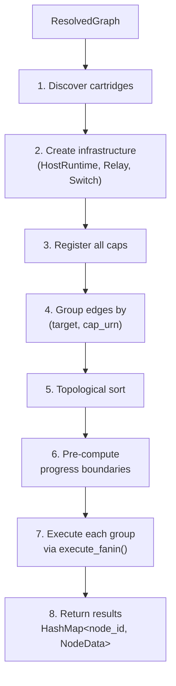
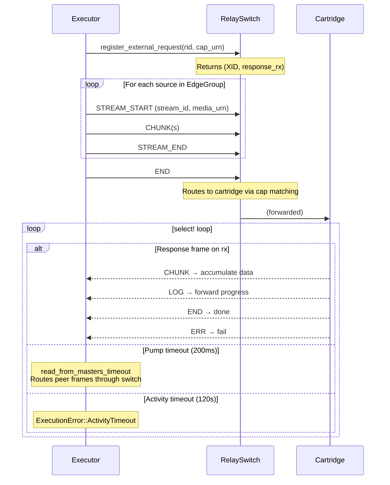

# Execution

How the executor runs a ResolvedGraph: cartridge discovery, edge grouping, topological ordering, and the execute_fanin loop.

## execute_dag



`execute_dag()` is the top-level function that takes a `ResolvedGraph` and runs it:

1. **Discover cartridges**: Collect all unique cap URNs from the graph's edges. For each, find a cartridge binary that provides it.
2. **Create infrastructure**: Set up a CartridgeHostRuntime, RelaySlave/RelayMaster pair, and RelaySwitch.
3. **Register all caps**: Register ALL manifest caps from each cartridge with the switch — not just the ones referenced by the DAG. This is necessary because cartridges may make peer invocations to caps that are not in the DAG but are in another cartridge's manifest.
4. **Group edges**: Group edges by `(target_node, cap_urn)` into `EdgeGroup`s.
5. **Topological sort**: Order groups by dependency so each group executes only after its inputs are available.
6. **Pre-compute progress**: Calculate progress boundaries for each group.
7. **Execute sequentially**: Run each group via `execute_fanin()`.
8. **Return results**: A `HashMap<node_id, NodeData>` with the output data from each node.

Source: `capdag/src/orchestrator/executor.rs`.

## Cartridge Discovery

Cartridge resolution for each cap URN in the graph:

1. **Dev cartridges** (local override): Check `dev_cartridges` — a map of local binary paths — using `is_dispatchable` matching. This lets developers test local builds without publishing.
2. **Cartridge registry** (remote): Fall back to the cartridge registry for published cartridges. The cartridge registry is versioned: a binary bakes a `CARTRIDGE_REGISTRY_VERSION` (currently `1`), and the published manifest URL carries a version prefix segment — `.../v1/manifest` — with the bare `/manifest` denoting the frozen v0 state. On disk, cartridges live at `{registry_slug}/v{cartridge_registry_version}/{channel}/{name}/{version}/`, and discovery pins the `v{version}` directory to the host's baked version exactly as it pins the channel — a v2 cartridge is invisible to a v1 host. The `registry_slug` is a path-safe transform of the registry URL's **authority** (host, plus `:port`): the substring after `://` up to the first `/`, `?`, or `#`, ASCII-lowercased, with every character outside `[a-z0-9.-]` replaced by `-` (a null registry URL becomes the literal `dev`); it is not a hash, and it depends only on the authority, so every version of one registry shares a slug. A cartridge registry is ingested only if its manifest's `fabricRegistryUrl` matches the client's own baked fabric registry, so every registry a client uses shares one fabric and keeps caps comparable. The local fabric cache is keyed by registry version, so a staging re-publish of the same version on a mutable channel can serve stale bytes — `resolve --no-cache` and `capdag cache clear|refresh` bypass or renew it.
3. **Download and verify**: If the binary is not cached locally, download it and verify its SHA256 hash.
4. **Register**: Add the cartridge binary to the CartridgeHostRuntime.

All manifest caps are registered because peer invocations from one cartridge may target caps in another cartridge that are not part of the DAG. For example, an ML cartridge's handler may call `modelcartridge` to download a model — this cap is not in the DAG but must be routable.

Source: `executor.rs`.

## Edge Grouping

Multiple edges targeting the same `(to_node, cap_urn)` are grouped into a single `EdgeGroup`. Each group represents one cap invocation, potentially with multiple input streams (fan-in).

For example, a cap that accepts both a PDF document and a prompt string has two edges pointing to the same target node — these become one EdgeGroup with two source streams.

Each source in the group becomes a separate STREAM_START/CHUNK/STREAM_END sequence within the single request.

Source: `executor.rs`.

## Topological Sort

Edge groups are sorted using Kahn's algorithm so that a group executes only after all groups whose output nodes it depends on have completed.

Groups at the same topological depth have non-deterministic relative ordering. The algorithm processes nodes without incoming dependencies first, removes their outgoing edges, and repeats until all groups are ordered.

Source: `executor.rs`.

## execute_fanin

`execute_fanin()` is the core function that executes a single cap invocation:

### Input Collection

For each source node in the edge group, look up its data in the `node_data` map. If any source is missing, fail with `ExecutionError::NoIncomingData`. Source data was produced by an earlier group's execution.



### Cap Invocation

1. Call `RelaySwitch::register_external_request(rid, cap_urn)` to set up routing. Returns `(XID, response_rx)` — the XID for frame routing and an `mpsc` channel for receiving response frames.
2. Send input streams: For each source, send STREAM_START (with stream_id and media_urn) → CHUNK(s) (with payload split at max_chunk boundaries) → STREAM_END.
3. Send END to signal all inputs are delivered.

### Response Collection Loop

The response is collected with a `tokio::select!` loop that does two things concurrently:

```rust
tokio::select! {
    pump_result = read_from_masters_timeout(200ms) => {
        // Route peer frames through the RelaySwitch
    }
    Some(frame) = rx.recv() => {
        last_activity = Instant::now();  // reset timeout
        match frame.frame_type {
            Chunk => { /* accumulate response data */ }
            End   => { /* response complete */ }
            Log   => { /* forward progress to callback */ }
            Err   => { /* execution failed */ }
        }
    }
}
```

The **concurrent pump** (`read_from_masters_timeout`) is necessary. Without it, a cartridge doing a peer call during request handling would deadlock: the peer request frames would arrive at the switch but have no path to the target cartridge, because the executor's response loop is only reading its own response channel, not pumping frames through the switch.

The 200ms timeout on `read_from_masters_timeout` ensures the loop checks both the response channel and the frame pump regularly.

### Activity Timeout

`DEFAULT_ACTIVITY_TIMEOUT_SECS = 120`. Any frame received on `rx.recv()` resets `last_activity`. If no frame arrives for 120 seconds, the executor aborts with `ExecutionError::ActivityTimeout`.

While idle, the executor logs a warning every 30 seconds to aid debugging.

Individual caps can override the default timeout via the `activity_timeout_secs` key in their metadata. This is checked before the default is applied.

Source: `executor.rs` (`DEFAULT_ACTIVITY_TIMEOUT_SECS`, `ACTIVITY_TIMEOUT_METADATA_KEY`).

## Progress Subdivision

Before execution, the executor pre-computes progress boundaries for each group:

```
boundaries[i] = i as f32 / n_groups as f32
```

Group `i` maps its progress to the range `[boundaries[i], boundaries[i+1])`. The `CapProgressFn` callback passed to `execute_fanin` wraps the cartridge's raw [0.0, 1.0] progress with `map_progress(child, base, weight)` where `base = boundaries[i]` and `weight = 1.0 / n_groups`.

This gives each group an equal share of the overall [0.0, 1.0] range. See [15.3-PROGRESS-MAPPING.md](/docs/15.3-progress-mapping) for the mapping formula.

## Error Handling

```rust
pub enum ExecutionError {
    CartridgeNotFound(String),        // no cartridge provides the cap
    ActivityTimeout { cap_urn, seconds }, // no frames for > timeout
    CartridgeExecutionFailed { cap_urn, code, message }, // cartridge returned ERR
    NoIncomingData { node },       // missing source node data
    IoError(String),
    HostError(String),
    FabricRegistryError(String),
}
```

All errors are terminal for the DAG execution. There is no retry logic — the caller decides whether to retry.

## Concurrent Execution

The current executor processes edge groups sequentially within a DAG. Groups at the same topological depth could theoretically run in parallel. The `Arc<RelaySwitch>` design supports this — interior mutability and shared routing tables allow concurrent `execute_fanin` calls. However, parallel execution is not yet implemented.

## Pipelined Execution

The reference executor pipelines **linear-chain segments**: maximal runs of
groups where each group's only input is the previous group's output, that
output has exactly one consumer, the downstream group takes no extra args, and
every handler in the segment reports unlimited capacity. Within such a segment,
all cap invocations open up front and per-edge forwarding tasks
(`forward_frames`) stream frames from cap i to cap i+1 live — the downstream
cap receives its first item before the upstream cap has emitted its last. Credit
flows per hop (acquire from the downstream cap's window, grant the upstream cap
as consumed — L10/L14), and the head group's input feed runs concurrently with
terminal collection (L15). Fan-out, fan-in boundaries, extra-args groups, and
positive handler capacities use the materializing path.

A positive handler capacity is an execution boundary because its admission
permit represents ownership of a concrete cartridge process slot from REQ
through terminal response. The executor runs that cap as a singleton segment,
materializes its output, and only then acquires a dependent segment. It must not
pre-acquire multiple bounded invocations: adjacent caps may resolve to the same
capacity-one cartridge, leaving the first invocation unfed while acquisition of
the second waits for the slot held by the first. This boundary preserves FIFO
admission and process-loss isolation; it is not a retry or fallback.

Every output STREAM_START is **audited against the producing cap's declared
effect contract at receipt** (`EffectAudit`, backed by
`CapUrn::is_conformant_runtime_output` — see 13.2 and 06 §4.2.2), at all
three receipt points: the pipelined hop (`forward_frames`), the batch
terminal collector (`collect_terminal_output`), and the incremental terminal
consumer (`TerminalOutput`). A violation is
`ExecutionError::EffectContractViolation` — hard, attributed `internal`,
naming the cap, effect, and expected vs actual.

Forwarded STREAM_START frames are then **relabeled to the downstream edge's
declared input arg URN** (`ResolvedEdge.in_media`) before being sent, exactly
as `send_group_input` labels a chain head's streams. Cartridges demux input
streams by arg-URN equivalence (see 13.2), so the producer's richer output URN
must not reach the consumer as the stream label. The audit runs FIRST — the
relabel deliberately substitutes the plan's declared arg URN for the
producer's claim, which without the audit would mask a lying cap. The plan
already proved the producer's output conforms to the edge's input;
`forward_frames` re-asserts that conformance and fails hard on a violation
(a wiring/type bug must surface at the hop, not as a missing-arg error inside
the cartridge).

Regime note: a pipelined intermediate node's data is never materialized into
the executor's result map — that is the point. Consumers needing an
intermediate value must reference it as a fan-out (which breaks the segment
there and materializes it). Chain sinks that DO materialize (split
boundaries) are additionally captured to disk when the host provides a
transient root — see §Transient Run Artifacts (Host Capture).

For incremental consumption of a terminal cap's output (unbounded streams),
use `TerminalOutput { next_item(), finish() }` — the streaming counterpart of
`collect_terminal_output`, sharing its frame semantics (END-carried final
progress, credit granting, callback delivery).

## Mid-Run Argument State (RunArgumentLedger)

`execute_plan` does not take an immutable argument map: it reads per-step
arguments through a `RunArgumentLedger` — the plan's mutable argument state
and its dispatch journal under one mutex. That mutex is the ordering rule for
the update/dispatch race: a whole-segment dispatch (trunk, post-region), a
ForEach body spawn, and an argument update serialize on it, and each update's
per-step outcome is decided in the same critical section that applies it.

- `snapshot_for_segment` journals a subplan's cap nodes as
  dispatched-and-exhausted and returns the values its invocations read — one
  atomic step, so an update lands entirely before or entirely after a
  segment's caps, never between them.
- `snapshot_for_body` journals one body's dispatch (`body_index + 1` bodies
  taken) and returns the values that body reads.
- `exhaust_bodies` marks a region's steps closed when its item source ends —
  no further dispatch exists for an update to reach.
- `apply` validates a whole batch (every token must name a cap node of THIS
  plan — step tokens are minted per plan, so a foreign token refuses the
  batch), then reports per update: **applied** (no dispatch yet),
  **applied-to-remaining-bodies(n)** (`n` bodies already took the old value),
  or **already-dispatched** (value left untouched — falsifying the record of
  work that already ran is exactly what the journal exists to prevent).

Keys are the plan's cap node ids (the strand steps' minted tokens). A host
exposes the ledger for the lifetime of one `execute_plan` call; the reference
CLI constructs one per run from its parsed arguments.

This layer exists only in the reference implementation: no mirror implements
the unified executor (`execute_plan`, ForEach regions, per-node argument
delivery), so the ledger carries no cross-mirror parity obligation until a
mirror grows an executor — at which point this section is its contract.

## Live-Feed Machines and Unbounded Terminals

A machine whose source is a live-feed reference (13.2 §Reference Media) is
not a special execution mode — it is the natural state of a machine, of
which the bounded file run is the degenerate case whose input happens to
end immediately. The execution core for live-feed machines lives in the
capdag library and is exercised by the **capdag CLI directly** (`capdag
run` on a machine with a live source, including the built-in
`media:live;synthetic` feed); machfab consumes the same library surface
and adds only platform-specific host mediation (sandboxed capture, TCC
attribution). Nothing live-feed-specific may exist only engine-side —
the CLI is the reference execution surface (DRY).

Two consequences for the executor:

- **Head feeding is unchanged** where the runtime resolves the reference:
  the engine passes the selector record as the head cap's main-input arg
  value — a small reference value, exactly like a file path — and the
  cartridge runtime's transport-resolution layer turns it into the
  unbounded input stream in-process. Host-mediated capture (the same
  `capdag::capture` dispatch, opened by the host) covers the two cases
  where the cartridge cannot be the resolver: a sandboxed cartridge that
  cannot open the device, and a live source feeding a **ForEach region
  directly** — per-item dispatch is engine-side, so the ENGINE opens the
  feed and dispatches one body per delivered item while the capture runs
  (in-flight bodies bounded, item snapshots published append-only, the
  tap registered so a stop closes it and the bodies drain).
- **Unbounded intermediates at mandatory split boundaries spool to
  disk.** A chain split the executor cannot avoid (same-admission-domain
  bounded caps, fan-out) materialises its sink; when that sink's stream
  is unbounded it streams to a temp-file spool instead of memory, and the
  downstream chain (or region driver) streams items back out of the
  spool. Memory stays bounded; the data is complete because the split
  semantics already required the feed to end first.
- **Unbounded terminals must be consumed incrementally.** A terminal
  whose STREAM_START declares `unbounded` MUST be routed to the
  incremental consumer (`TerminalOutput`) or an `IncrementalWriter`
  (persisted sinks) — the buffering `collect_terminal_output` refuses
  unbounded streams by contract (12.4 §Unbounded). Recording-to-disk is
  the persisted-sink path applied to a live run; a properly stopped
  recording is a complete file because of the drain semantics below.

## Transient Run Artifacts (Host Capture)

Intermediate chain sinks — the transcription between two model caps, the
frames between a bridge and its ForEach — are neither outputs (no listing;
not things meant to keep) nor messages (too big for memory). When the
runtime provides a transient root (`EngineRuntime::transient_artifact_root`,
default `None` — the CLI and reference runtimes keep temp+delete), the
executor captures every intermediate chain sink **at the moment it
materializes**, mid-run:

- A memory-materialized (bounded) sink is written in its canonical byte
  form; a spool-engaged (unbounded) sink's spool file is **adopted** —
  moved, not copied — and downstream consumers read the adopted path.
- Each capture is one directory: `{root}/{node_id}/data` plus a
  `provenance.json` sidecar carrying media urn, cardinality, byte count,
  and — for sequences — every item's `[offset, len]`, so a reader
  previews item N with one bounded read. Publication is **atomic**:
  captures stage into `{node_id}.tmp` and rename into place, so a
  published directory always holds its sidecar; a `.tmp` directory is an
  in-flight (or crashed) capture, invisible to readers, owned by the
  host's TTL reaper.
- `EngineRuntime::on_transient_artifact` fires per capture and returns
  `Result` — a publication failure is a hard execution error, because an
  inspection surface that silently diverges from disk is an illegal state.
- ForEach **body** sinks are never captured (body guts are excluded by
  design — region items and outputs have their own surfaces).
- There are NO database rows: the filesystem is the index, an absent
  directory is the legal expired state, and the host's eager GC (run
  deletion, startup sweep, TTL reaper) owns every lifetime.

**One node, one truth.** A chain sink's data is recorded in the result
map's memory form OR as a spool path — never both. A spool-engaged sink
does not appear in `node_data` (its in-memory remainder is not the
stream), and the region driver refuses an input present in both maps as
an executor contract breach rather than guessing. With transients on,
adopted spool paths are excluded from plan-end spool cleanup — the
reaper owns them.

## Runs Stop

A machine is running or it is not. "Cancel" belongs to the task layer and
the wire frame that implements abort (a Cancel frame cancels a *request*);
at the run level the vocabulary and the semantics are **stop**:

- **A run stops on its own** when its input stream ends: a file right
  after its content; a live feed when a stop condition (`duration_ms`,
  `max_items`) fires or the device closes. Same END, same path — bounded
  input is the case where this happens immediately.
- **A run is stopped** by closing the tap: the runtime closes the
  request's live feeds, the feed's input stream ends, and the machine
  **drains** — every in-flight item flows through, terminals end
  normally, writers finalize. The outputs of a stopped run are complete
  (a stopped recording is a valid file). On the wire this is a non-force
  Cancel for a feed-bearing request: the runtime closes feeds and lets
  the request end naturally instead of interrupting the handler.
- **A run is aborted** by the existing force cancel cascade — the hard
  variant for a run that must die now, in-flight work discarded. Abort is
  the escalation, never the default stop.

**Control surfaces.** Stop and abort are DIFFERENT controls everywhere:
the engine exposes `TaskService.StopTaskInput` (close the running task's
live taps — host-opened feeds directly, cartridge-resolved feeds via
non-force Cancel on their FEED-BEARING requests, which the shared executor
records through the `FlowObserver` seam — then the run drains and
completes WITH its outputs; the task's status is untouched) alongside
`CancelTask` (abort). On the wire the stop is
`RelaySwitch::stop_request_feeds` — the non-force Cancel FRAME sent to the
feed-bearing request WITHOUT touching host-side request state (terminating
host state is the abort's job; doing it on a stop severs routing mid-drain
and wedges the run). The loom run header renders a LIVE run's controls
first-class: "Stop input" (tap-off) and "Abort" — no hidden modifier; a
bounded run keeps one Stop (cooperative cancel, ⌥/Alt force-kills). In the
capdag CLI the first Ctrl-C is the stop
(taps close, the machine drains, outputs are emitted); a second Ctrl-C
aborts. Stopping the input is also how a capacity-bounded cartridge frees
up mid-machine: its live consumer finishes on the drained input and the
permit passes to the next cap.

There is no plan-time restriction on unbounded inputs: `is_sequence` on
the consuming arg already decides the wiring (a sequence-consuming fold
links directly and defers emission until END — which stopping delivers; an
item-consuming cap gets ForEach), and emission timing is op policy, not
type structure. A fold over a live feed is a valid deferred-emission plan:
`concat` over a microphone emits the whole recording when the run stops.
