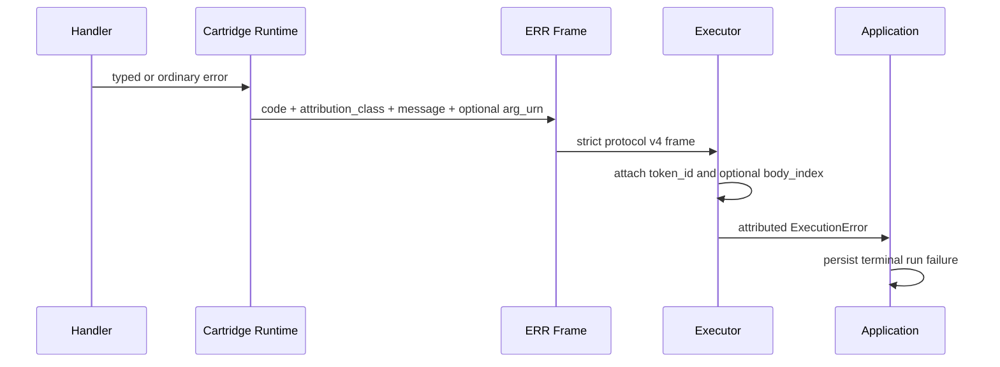

# Error Handling

CapDAG carries the identity and location of a diagnostic structurally. Source
code declares the meaning; transport and execution layers preserve it without
parsing prose or inventing missing values.

## Attribution Class

`AttributionClass` identifies the domain responsible for a diagnostic. It is
used by terminal ERR frames and by every non-progress LOG frame.

| Class | Meaning | Terminal retry policy |
|-------|---------|-----------------------|
| `input` | Deterministic on supplied input or arguments. | Permanent. |
| `resource` | A compute resource was exhausted. | Retryable. |
| `environment` | Deployment, network, registry, model, or process environment failed. | Retryable. |
| `internal` | An engine or cartridge defect. | Retryable, but owned by us. |

Classification is declared at the typed error definition or diagnostic emit
site. Wrapping layers carry it verbatim. An ordinary handler error that reaches
the terminal emit boundary without a typed classification is explicitly
emitted as `HANDLER_ERROR` / `internal`; that is a source-boundary decision, not
a receiver fallback.

## Wire Contract

Protocol v4 uses one attribution shape for source diagnostics:

| Frame | Required metadata | Optional metadata |
|-------|-------------------|-------------------|
| non-progress LOG | non-empty `level`, non-empty `message`, valid `attribution_class` | non-empty `arg_urn` |
| ERR | non-empty `code`, non-empty `message`, valid `attribution_class` | non-empty `arg_urn` |
| progress LOG | `level = progress`, `progress` | none of the diagnostic attribution fields |

The wire key is `attribution_class`. There is no legacy `class` key. Missing or
unknown class tokens, empty required text, an empty `arg_urn`, or diagnostic
metadata on a progress frame are protocol violations. Receivers fail the
malformed request or stream; they never infer `internal` or an argument.

## Graph Coordinate

The location of a diagnostic is assembled by the execution layer from stable
machine notation and the source frame:

- `token_id` is the stable `StrandStep.token_id` and addresses the graph step.
- `body_index`, when present, is only the zero-based invocation ordinal within
  a ForEach region. It never identifies a graph node.
- `arg_urn`, when present, identifies the one argument named by the emit source.

The complete coordinate is therefore `token_id` plus optional `body_index` plus
optional `arg_urn`. A diagnostic without a step token is machine-scoped. A body
or argument cannot exist without a step token, and an argument is never inferred
from message text.

ForEach region failures use the region step's stable token. Internal executor
names such as `foreach_region_1` are not user-facing addresses.

## Terminal Failure Path

Terminal failures remain durable. The engine persists their class, code,
reason, step token, optional body ordinal, and optional argument using the
existing run-failure model. The database column `attribution_class` stores the
same `AttributionClass` token carried by the protocol; it does not define a
second taxonomy.

## Live Diagnostic Path

Non-progress LOG frames take the same route through the cartridge host, relay,
executor, and engine, where the stable step coordinate is attached. They are
then broadcast to connected clients as ordered live run diagnostics.

These ordinary diagnostics are deliberately transient:

- they are not written to the structured run database;
- they are not replayed after reconnect or application restart;
- clients retain them in bounded memory and may report dropped ranges;
- the normal logging sinks remain responsible for long-term operational logs.

Progress LOG frames are excluded because they already drive progress state and
have a separate functional lifecycle.

## Capacity and Process Loss

Admission is per POOL, keyed by full install identity plus pool name, and is
driven by the mandatory pool-state map declared in HELLO and refreshed on
every heartbeat reply. A dispatch is held against its cap's whole pool CHAIN
— the cap's own singleton pool, every declared shared pool containing it,
then `all` — admitted only when every chain pool has room, in one atomic
decision. Zero capacity means unlimited; for a positive effective capacity
(`min(configured, available)`), work beyond it waits in FIFO order on the
cap's singleton queue. Several process records carrying the same full install
identity share those admission targets; host registration order selects the
authoritative map, matching host-side request dispatch. Distinct install
identities claiming the same selected cap are an ambiguity and fail hard.
A NOT-RUNNING record's `all` pool is clamped to one — the cold-start canary:
the first body proves the spawn before the advertised capacities apply.

Caps whose chains share a bounded pool are materialization boundaries in DAG
execution. The executor feeds and completes one such cap before admitting a
dependent cap contending for the same pool; it never pre-acquires multiple
bounded requests for a live pipeline. The admission permit denotes actively
owned pool slots, so pre-acquisition could otherwise wait for a downstream
slot while the upstream owner remains unfed. Chains sharing no bounded pool
— different cartridges, or same-cartridge caps in disjoint bounded pools —
continue to stream live.

If a cartridge process dies, only requests actively owned by that process fail.
Queued bodies are not assigned terminal failure from another body's process
loss. An admission target that goes unavailable does NOT reject its waiters:
they stay queued for `ADMISSION_UNAVAILABLE_GRACE` (60s, measured from the start
of the outage, not from each waiter's arrival), so once a replacement instance
advertises capacity the queued work is admitted to that live instance. The
window is a bound, not a retry — an outage that outlives it fails its waiters
hard, classified `environment` (`RelaySwitchError::CartridgeUnavailable` →
`ExecutionError::CartridgeUnavailable`), so a target that is genuinely gone
surfaces promptly instead of stalling the run. Admission is mirrored in Rust,
Go, Python and ObjC; `capdag-js` has no bifaci runtime. This preserves body isolation in
ForEach execution while keeping process death visible as an `environment`
failure on the affected body.

A host that RETIRES a cartridge (a roster sync says the install is no longer
wanted) drains it rather than killing it: it leaves the cap table at once, and
its process survives until the requests it is already serving terminate. Work
killed by a retirement is attributed `CARTRIDGE_RETIRED` / `environment` — never
`CANCELLED`, which claims a user cancelled something nobody cancelled.

Cancellation releases an admission waiter or active permit exactly once. It
does not create diagnostic history, and no routing-state cleanup redesign is
required for this behavior.

## Presentation

FabricLoom groups live info, warning, and error diagnostics at the most specific
available coordinate. A durable failure and its live error diagnostics share
one node or machine panel rather than producing duplicate error surfaces.
Machine-scoped diagnostics remain visible at machine scope. Node badges expose
counts; bounded, scrollable panels preserve chronological detail.

## Invariants

- Source code declares class and optional argument; downstream layers do not guess.
- `token_id` addresses a step; `body_index` addresses only a ForEach invocation.
- One body failure does not terminate unrelated queued bodies, and neither does
  a transient outage of the cartridge they are queued on.
- Errors are durable; ordinary logs are live-only; progress remains functional state.
- Unknown protocol values fail hard instead of activating compatibility behavior.

The repository-root `docs/failure-taxonomy.md` defines the corresponding
application-level persistence and UI contract.
